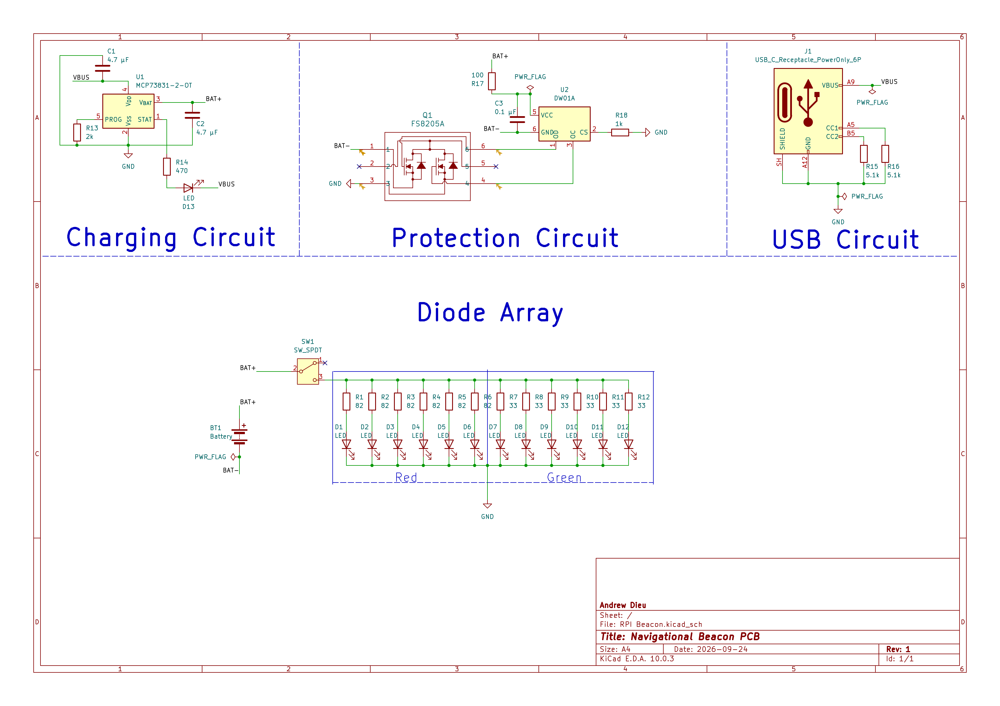
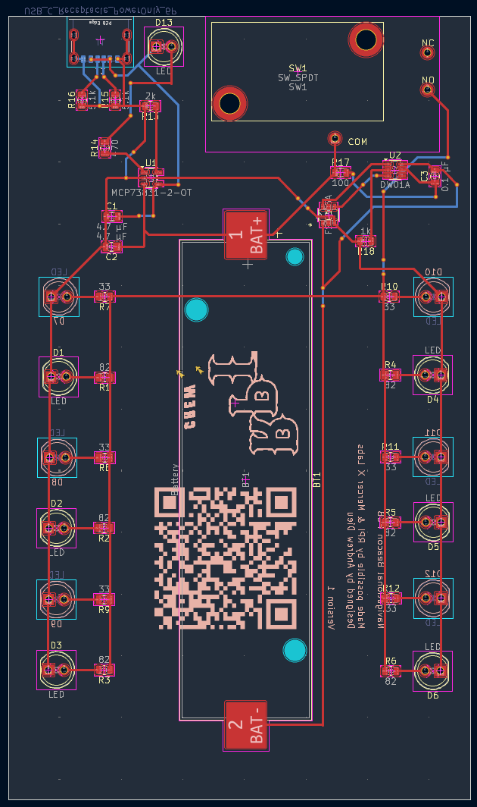

# Navigational Beacon PCB

A rebuild of the RowKraft Beacon, a small red/green nav light for rowing shells. The original board is from 2012 (RowKraft LLC). I'm redesigning it in KiCad with a few upgrades because I can, (mostly I can't afford 55 dollars):

- 18650 cell in a PCB holder instead of the old 1000 mAh pouch cell
- Battery protection on the board (DW01A + FS8205A)
- USB-C charging instead of USB-B (Big '26)
- Its own current-limiting resistor for each of the 12 LEDs (6 red, 6 green)

The board mounts along the boat's centerline inside a sealed, semi-transparent 3D printed tube. Red LEDs are on the front (port side), green on the back (starboard side). Screwing down the end cap presses a lever microswitch, which turns the lights on.

**Status:** Version 1 Gerber/Drill files created! Prototyping very soon I hope lol.

## Schematic

Rough breakdown:

- **Charging:** MCP73831 linear charger, set to 500 mA by R13. The yellow LED is on while charging and turns off when it's done.
- **Protection:** DW01A watches the cell and switches the FS8205A dual MOSFET in the negative lead. Cuts off on overcharge, overdischarge, and overcurrent.
- **USB:** power-only USB-C jack with 5.1k pulldowns on both CC pins so USB-C chargers will actually supply 5 V.
- **LEDs:** 12 parallel branches off the switched battery rail, each at about 20 mA. Total draw is around 240 mA.

## PCB Layout 

PCB Dimensions are exactly 75mm x 127mm

## Runtime

Rough Napkin math calculates about 10 to 12 hours on a 2500 to 2800 mAh cell. Brightness drops as the battery drains, green more so than red, so expect around 7 to 8 hours at good brightness.

## BOM

| Ref | Qty | Part | Value / Part # | Footprint |
|---|---|---|---|---|
| U1 | 1 | Li-ion charger | 4.2 V, 500 mA / MCP73831T-2ACI/OT | `Package_TO_SOT_SMD:SOT-23-5` |
| U2 | 1 | Battery protection IC | DW01A | `Package_TO_SOT_SMD:SOT-23-6` |
| Q1 | 1 | Dual N-MOSFET (protection switch) | FS8205A | `Package_TO_SOT_SMD:SOT-23-6` |
| C1, C2 | 2 | Charger input/output capacitors | 4.7 uF, 10 V, X5R | `Capacitor_SMD:C_0805_2012Metric` |
| C3 | 1 | DW01A supply filter capacitor | 0.1 uF | `Capacitor_SMD:C_0805_2012Metric` |
| R1-R6 | 6 | Red LED resistors (one per LED) | 82 Ohm | `Resistor_SMD:R_0805_2012Metric` |
| R7-R12 | 6 | Green LED resistors (one per LED) | 33 Ohm | `Resistor_SMD:R_0805_2012Metric` |
| R13 | 1 | Charge current set (PROG) | 2 kOhm | `Resistor_SMD:R_0805_2012Metric` |
| R14 | 1 | Charge status LED resistor | 470 Ohm | `Resistor_SMD:R_0805_2012Metric` |
| R15, R16 | 2 | USB-C CC pulldowns | 5.1 kOhm | `Resistor_SMD:R_0805_2012Metric` |
| R17 | 1 | DW01A VCC resistor | 100 Ohm | `Resistor_SMD:R_0805_2012Metric` |
| R18 | 1 | DW01A CS resistor | 1 kOhm | `Resistor_SMD:R_0805_2012Metric` |
| D1-D6 | 6 | Nav LEDs | Red 5 mm, clear lens | `LED_THT:LED_D5.0mm` |
| D7-D12 | 6 | Nav LEDs | Green 5 mm, clear lens | `LED_THT:LED_D5.0mm` |
| D13 | 1 | Charge status LED | Yellow 5 mm | `LED_THT:LED_D5.0mm` |
| J1 | 1 | USB-C power-only receptacle | 6-pin / GCT USB4125-GF-A | `Connector_USB:USB_C_Receptacle_GCT_USB4125-xx-x_6P_TopMnt_Horizontal` |
| SW1 | 1 | Lever microswitch, SPDT | Omron V-152-1C25 | Custom `V-152-1C25` (project library) |
| BT1 | 1 | 18650 PCB-mount holder | Keystone 1042 | `Battery:BatteryHolder_Keystone_1042_1x18650` |
| - | 1 | 18650 cell, unprotected | Samsung 25R, Molicel P28A, or similar | — |
| - | 2-4 | Mounting hardware | M3 / Screws, nuts, standoffs | `MountingHole:MountingHole_3.2mm_M3` |

## Things to know

- **Charge with the cap off.** If the LEDs are on while charging, the charger never sees the current taper off, so the status LED stays lit even when the cell is full.
- **FS8205A pinouts vary between manufacturers.** This design uses the SOT-23-6L version: 1 = S1, 2/5 = drain, 3 = S2, 4 = G2, 6 = G1. Check the datasheet for whatever you buy.
- **Green LED resistor values assume Vf around 3.0 V.** If your green LEDs are the older ~2.2 V type, recalculate.
- **Use an unprotected button-top or flat-top 18650** from a real vendor. The board handles protection. Protected cells are longer and may not fit the holder.
## To do

- [ ] PCB layout (kinda in progress)
- [ ] Order boards and parts
- [ ] Housing and end cap

## Credit

Original design by RowKraft LLC (rowkraft.com), 2012. This is a from-scratch redraw based on a board I took apart, not their files btw please don't sue.
